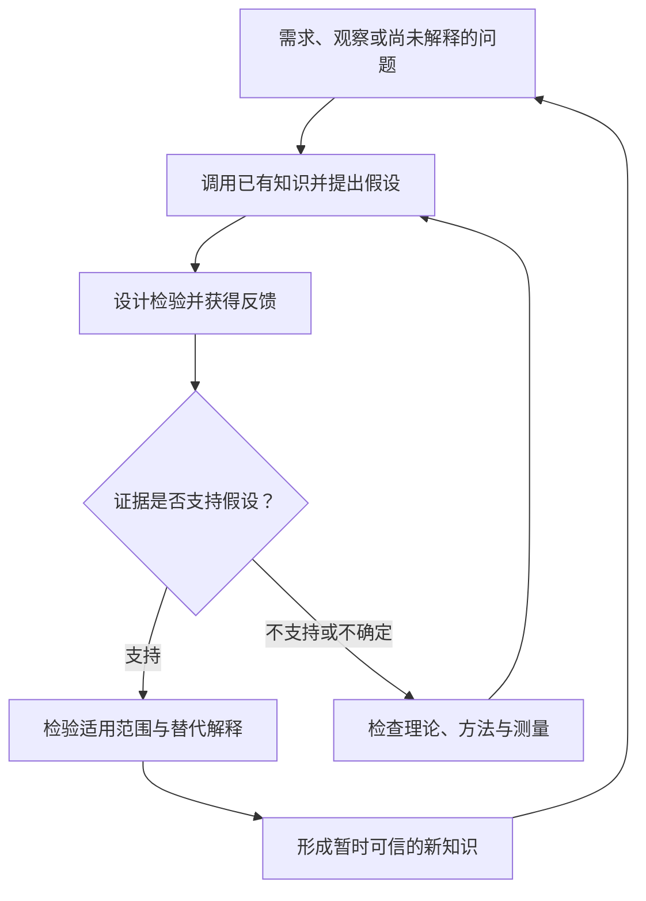
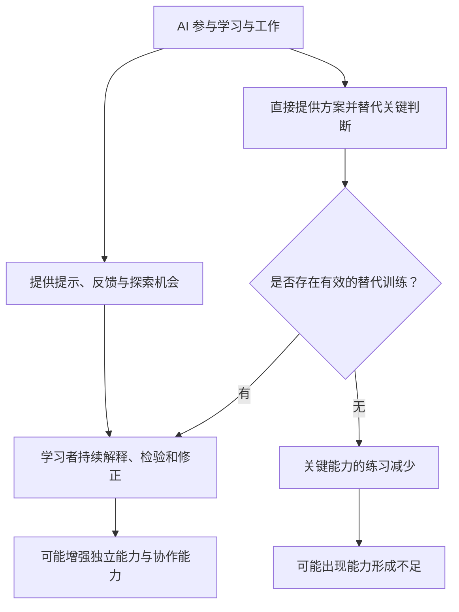
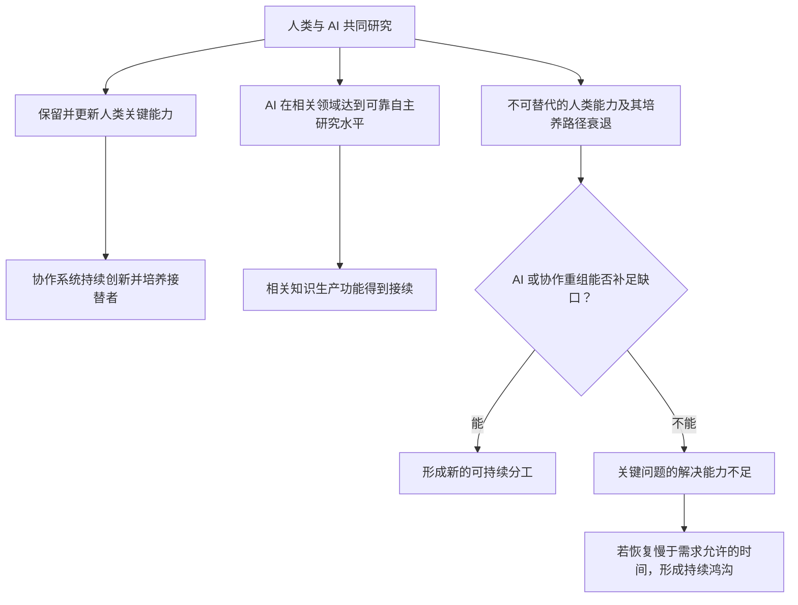

# LLM 时代的知识生产能力鸿沟：一个关于人才再生产的假说

## 1. 问题提出与核心假说

假设一个研究团队借助 AI，能够更快阅读文献、编写代码、提出方案并完成实验。团队的产出增加了，但年轻成员越来越少亲自经历问题建模、错误诊断和假设修正。几年以后，他们能否接替今天负责判断方向、识别异常和培养新人的研究者？

这一情景揭示了当前产出与长期能力再生产之间的潜在分离：**知识生产系统可能在提高当前产出的同时，削弱自身培养下一代知识生产者的能力。**

据此，可以提出一个有条件的机制假说：如果 AI 使用方式持续挤出了形成关键研究能力的训练，而新的教育与工作方式未能补足这些训练，那么当前的生产力增长，可能伴随未来人才供给与独立判断能力的下降。当 AI 和人机协作又无法弥补这些能力缺口时，就可能出现“知识生产能力鸿沟”。

> **这一风险表现为：系统仍能维持当前产出，但培养下一代、纠正自身错误和应对新问题的能力逐渐减弱。**

这一假说尚待经验检验，其中的因果关系、能力门槛和恢复时滞均未得到确认。其成立不以“使用 LLM 必然导致人类能力退化”为前提，也不要求将 AI 完全自主视为持续创新的必要条件。

## 2. 概念界定：产出、能力与能力再生产

### 已有知识不等于持续发现的能力

“新知识”在此定义为相对于相关领域已有知识的新增贡献，并经过与任务相适应的证据检验。一个人第一次学会某个定理，是个人学习；发现并验证一个此前未知的关系，则属于这一意义上的知识生产。

知识生产可以包含重新组合已有方法，但新颖的表达、更多的代码或更多的论文，本身不能证明形成了可靠的新知识。研究还需要界定问题、选择检验方式、解释失败，并在证据不支持原有理解时作出修正。

图示概括了知识生产中假设与证据反复交互的过程。这一框架不要求所有发现遵循相同的线性步骤，也不意味着一次成功检验足以确认理论。

### 三个核心概念

| 记号 | 含义 | 需要避免的混淆 |
| --- | --- | --- |
| $H(t)$ | 人类在不依赖 AI 提供关键认知贡献时，推进知识生产的能力 | 不等于研究者人数，也不要求摆脱仪器、文献、软件和人类协作 |
| $A(t)$ | AI 在不依赖人类提供关键认知贡献时，推进知识生产的能力 | 不等于回答质量，也不等于完全脱离人类提供的基础设施 |
| $S(t)$ | 人类、AI、研究工具与组织共同构成的系统的有效知识生产能力 | 不能简单写成 $H(t)+A(t)$；协作方式与相互依赖会影响结果 |

“关键认知贡献”包括决定研究方向、识别实质性错误、修正核心假设，以及判断证据是否足以支持结论。

上述记号用于区分分析对象，尚不构成可直接应用的统一量表。实际研究应按领域、任务和资源条件分别测量。数学研究中的自主能力，不能直接代表实验科学中的自主能力。

产出指一定时期内完成的成果，能力指应对特定问题集合的潜在表现，**能力再生产则指持续培养接替者，并更新解决新问题所需能力的过程**。三者相关，但不能互相替代。

因此，人类某些独立技能下降，并不自动意味着整体创新能力下降。关键在于，被削弱的能力是否仍然不可替代，以及这些能力能否持续获得补充。

## 3. 作用机制：认知外包与能力形成

使用 AI 既可能减少训练，也可能改善训练。关键在于学习者是否仍然承担需要形成能力的认知工作。

例如，学习者先提出解释，再请 AI 给出反例，随后用实验判断双方的解释，这可能增加有效练习。反过来，如果学习者直接接受完整方案，只负责执行和提交，那么任务完成并不能说明他学会了如何提出或修正方案。

这一风险机制可以分解为四个需要分别验证的因果环节：

| 因果环节 | 成立所需的条件 | 可能使它不成立的情况 |
| --- | --- | --- |
| 认知外包增加 → 关键练习减少 | AI 替代了学习者的建模、判断或修正，而不仅是机械操作 | 节省的时间被用于更多独立探索与验证 |
| 关键练习减少 → 能力形成不足 | 被减少的练习确实有助于迁移、判断和发现 | 新的训练方法以更低成本形成了同等或更强能力 |
| 个体能力不足 → 人才供给减弱 | 影响范围足够大，且其他培养路径无法补足 | 参与研究的人数增加，足以抵消部分个体能力变化 |
| 人才供给减弱 → 系统出现缺口 | 缺失的人类能力仍不可替代，且协作方式不能弥补 | AI 或新型团队分工接管了相关功能 |

AI 使用频率上升本身不足以证明文明创新能力下降。上述因果链中的每一环节都需要独立的证据支持。

同样，也不能把所有困难都视为必要训练。反复查找格式、处理重复操作，与在失败后重建问题模型，可能具有完全不同的训练价值。需要保留的是能形成理解、迁移和判断的练习，而不是无差别地增加学习成本。

因此，需要检验的核心问题是：**认知步骤自动化后，哪些能力不再必要，哪些能力仍需通过替代训练形成？**

## 4. 人才再生产与代际传递

### 已有能力的增强与新能力的形成

假设一位已经建立深厚专业判断的研究者，用 AI 显著提高了效率。这一结果能够说明 AI 在该条件下增强了已有能力，但不足以证明从学习初期就依赖 AI 的新人也能形成相应的判断能力。

这两类问题需要不同的观察设计。成熟研究者也可能发生技能退化，新人也可能在 AI 帮助下学得更好；不能仅按是否经历过“前 LLM 时代”判断能力高低。

当前成熟研究者的潜在价值，在于他们可能同时拥有长期实践形成的判断和新的工具能力。如果这种组合难以自动复制，那么如何传承、改造其训练过程，就成为能力再生产中的关键问题。

### 初级岗位可能兼有生产与培养功能

设想一家企业发现，高级工程师配合 AI 就能完成过去需要多名初级工程师承担的任务，于是减少初级岗位。企业可能获得短期收益，但未来高级工程师从哪里成长起来，仍需有可行的答案。

这是一种可能的机制，并非对现实招聘变化的因果结论。需求扩张、新岗位、自主学习、开源实践和专门培养项目，都可能改变结果。博士培养也不必遵循唯一的职业阶梯。

由此产生的制度问题是：**当工作过程不再自然提供训练时，训练成本由谁承担，真实问题、有效反馈和逐步独立负责的机会由何种机制提供？**

研究者人数的变化可以用以下存量关系表示：

$$
N_{t+1}=N_t+E_t-X_t
$$

其中，$N_t$ 是按既定标准界定的研究者人数，$E_t$ 是该时期新达到标准的人数，$X_t$ 是退出该群体的人数。退出应避免重复统计。

这个关系不能直接当作 $H(t)$ 的变化公式。同样的人数，可能具有不同的专业覆盖、判断能力和协作效率；人数增加，也可能与某个关键领域的人才断层同时发生。

### 培养能力本身也可能受损

更深一层的风险是：如果导师、真实研究机会和有效反馈减少，新人达到独立水平的速度也可能下降，从而进一步削弱培养能力。

这种反馈可能形成恢复困难，但“难以恢复”不等于“不可逆”。AI 教学、跨机构培养、人才流动和制度调整，都可能打断这一过程。

因而，有效干预窗口取决于培养网络何时失去功能，不能仅由现有研究者的年龄或寿命推算。这一机制尚不足以确定风险发生的具体年份或能力恢复所需的年限；相关时间尺度需要按领域和培养条件分别估计。

## 5. 知识生产能力鸿沟的成立条件

### 三条可能路径

“人类 → 人类与 AI → 自主 AI”构成一条可能的演化路径。长期人机协作同样可能形成持续创新的稳定基础。

第一条路径不要求 AI 完全自主。只要人机系统能够持续发现、纠错并培养必要的人类参与者，它就可以成为稳定形态。

第二条路径要求 AI 在相关领域可靠接续所需功能。“能够自主研究某类问题”仍不代表已经解决所有领域的问题，也不等于获得了文明层面的全面安全保证。

第三条路径对应人才再生产受损的风险：关键的人类能力先失去补充，而技术与组织尚未建立可行的接续方式。

### 能力下降是预警信号，尚不是充分条件

令 $H_{\text{safe}}$ 表示在给定领域、工具和组织条件下，维持必要研究与培养功能所需的人类能力下限；用 $A^*$ 表示 AI 在相关领域可靠承担自主知识生产功能的门槛。

以下条件：

$$
H(t)<H_{\text{safe}}\quad\land\quad A(t)<A^*
$$

可以作为系统脆弱性的预警信号，但不足以单独判定鸿沟已经出现。人机互补可能使双方单独都不足以完成的任务，在协作中得到解决；工具进步也可能改变所需的人类能力下限。

更直接的判据，是整个系统能否满足明确界定的知识生产需求。设 $S_{\text{need}}(t)$ 表示应对这些需求所需的系统能力，则实际缺口可以概念性地写为：

$$
S(t)<S_{\text{need}}(t)
$$

将这一缺口归因于人才再生产受损，还需要满足以下归因条件：关键人类能力及其培养路径的衰退是重要原因，AI 和协作重组未能弥补，而且恢复所需时间超过相关问题允许等待的时间。

这可以把“短暂适应困难”“需求突然变难”和“人才再生产受损造成的持续鸿沟”区分开。它也意味着：某个领域出现缺口，不足以直接推出文明整体正在衰退。

### 自主 AI 的两个思想实验

第一个思想实验是“癌症测试”：给定一个高层研究目标，例如寻找能够治愈某一种癌症的疗法，考察 AI 能否持续拆解问题、提出假设、设计检验、识别异常并修正研究路线，而不依赖人类补上关键科学判断。

这个测试关注的是研究过程中的认知自主性。某个治疗目标的最终成败，还受到问题难度、资源和观察时间等条件影响；单次成功或失败不能充分判定通用自主研究能力。这里也不以取消人类监督作为自主性的判据。

第二个思想实验是“递归自我改进”：考察 AI 能否研究自身瓶颈、提出改进，并通过独立评估确认后续系统的能力提升。这一实验涉及不同的能力维度：能够改进自身，不保证能够解决其他领域的开放问题；不能持续改进自身，也不排除它已能在某些领域独立发现新知识。

这两个思想实验用于细化自主研究的能力要求，不构成必须同时满足的普遍门槛。

## 6. 竞争性解释与假说的可证伪性

这一假说需要明确能够削弱或否定其解释的证据。若所有技能变化都被解释为退化，而所有产出增长又被解释为“掩盖退化”，该假说就失去了可证伪性。

| 反驳 | 对假说的挑战 | 应重点观察什么 |
| --- | --- | --- |
| AI 扩大了研究参与面 | 即使部分人的某些技能下降，更多人进入研究也可能提高整体能力 | 达到独立研究水平的人数、领域覆盖与成果质量 |
| AI 可以成为更好的导师 | 更及时的反馈和更合适的练习，可能加速能力形成 | 延迟测试、陌生问题迁移、错误识别和自主提出假设的表现 |
| 新技能取代了旧技能 | 减少手工操作不必然损害创新，可能释放更高层思考资源 | 新能力能否完成验证、纠错和开辟方向等关键功能 |
| 人机协作可以长期稳定 | AI 无需完全自主，人类也无需保留全部旧技能 | 协作系统能否持续创新，并培养掌握必要能力的接替者 |
| 科学能力分布在团队和制度中 | 少数个体的独立能力不足，不代表整个网络失效 | 团队互补、跨团队验证，以及导师和机构之间的知识传递 |
| 经济与教育系统会自我修复 | 能力稀缺可能带来更高回报和新的培养投入 | 反馈是否及时，培养能否在关键能力断层之前完成 |

计算器、搜索引擎等工具的历史类比可以帮助提出问题，但既不能直接证明本次变化无害，也不能证明它必然更危险。需要比较的是：工具替代了哪些认知环节，这些环节如何影响训练，以及替代训练是否有效。

如果长期观察发现，AI 使用者在可靠研究产出增加的同时，独立判断、迁移能力与培养接替者的能力也稳定或提高，则上述风险机制在相应条件下得不到支持。

反过来，短期无 AI 测试成绩下降也不足以支持整个假说。还需要判断：下降的是过时操作技能，还是协作系统仍依赖的关键判断能力。

## 7. 经验检验与研究设计

### 同时观察任务表现和能力形成

一种可行的研究设计是在相同课程或工作任务中，比较不同 AI 使用方式：独立完成、获得提示后自行完成、直接取得完整方案，以及先独立判断再用 AI 检验。

在条件允许时，可采用随机分组；否则需要尽量处理先验能力、任务难度、投入时间和资源差异。评估应同时包括当场任务结果和经过一段时间后的能力表现，避免用一次交付代表长期学习。

| 层面 | 可观察指标 | 不能单独据此推断什么 |
| --- | --- | --- |
| 当前任务 | 完成时间、正确率、成果质量 | 不能直接推断学会了多少 |
| 独立能力 | 延迟测验、陌生问题迁移、识别错误建议、提出可检验假设 | 不能直接推断社会整体创新能力 |
| 协作能力 | 使用 AI 时的纠错率、验证质量、对模型失误的应对 | 不能直接推断 AI 自主能力 |
| 人才再生产 | 新人承担独立研究职责的比例、成长时间、导师供给和真实实践机会 | 不能只靠岗位名称或人数判断 |
| 系统结果 | 可验证的新贡献、成果复现、关键问题解决及其领域覆盖 | 不能只靠论文数、代码量或单次突破判断 |

“不依赖 AI”测试也应保留合理的文献、仪器与常规软件条件，避免把脱离所有工具的记忆竞赛误当成独立研究能力。

### 区分相关性与因果归因

如果高频使用 AI 的人独立表现更差，可能是 AI 使用方式影响了训练，也可能是原本更困难的人更依赖 AI。研究者需要尽量区分这两个方向。

同样，初级岗位减少可能受到多种因素影响；研究产出增加也可能来自投入扩张或评价标准变化。对这一机制的检验需要追踪“使用方式—训练机会—能力形成—人才接续—系统结果”之间的联系，而不是只比较起点和终点。

### 最值得优先验证的三个未知量

1. **训练效应：** 哪些 AI 使用方式提高或削弱长期能力？哪些被自动化的步骤需要替代训练？
2. **替代与互补边界：** 人机系统仍依赖哪些人类判断？这些判断减少时，AI 和团队重组能补足多少？
3. **恢复时滞：** 出现能力缺口后，通过改进培养、补充导师或引入新工具，恢复需要多久？

对这些问题的分领域检验，有助于估计能力变化、功能替代与恢复时滞之间的关系。

## 8. 实践含义与结论

在假说尚未得到证实的情况下，可将以下培养方式纳入比较研究：让学习者先形成判断，再使用 AI；要求解释方案为何成立、怎样可能失败；保留承担完整问题的机会；同时评估当期交付和后续独立表现。

企业与研究机构也可以检验：当初级任务被自动化以后，是否能用新的学徒项目、导师反馈和逐步负责机制，提供更有效的成长路径。这些安排的价值应由学习效果与研究结果来判断，不能仅因它们保留了传统训练形式就认定有效。

对于现有成熟研究者，值得投入的方向有两个：一方面推动 AI 承担更多可靠的研究功能，另一方面将关键判断转化为下一代可以练习、获得反馈并逐步掌握的能力。这两项工作可以相互促进。

这一假说的核心命题可以概括为：

> **当认知任务被自动化时，一个知识生产系统必须继续补充其中仍然不可替代的能力。若这些能力及其培养路径先衰退，而技术与组织尚未完成接续，就可能出现持续的知识生产能力鸿沟。**

**知识生产系统的可持续性，需要同时考察当前产出与未来能力再生产：效率提升能否伴随判断、发现和纠错能力的持续形成，是评估这一转型的关键问题。**
